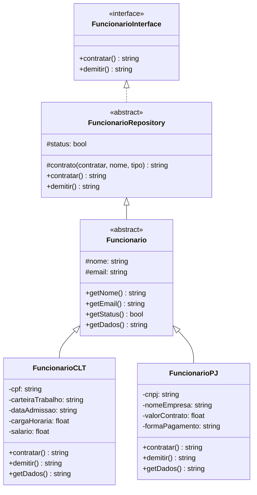

```mermaid
classDiagram
    class FuncionarioInterface {
        <<interface>>
        +contratar() string
        +demitir() string
    }

    class FuncionarioRepository {
        <<abstract>>
        #status: bool
        #contrato(contratar, nome, tipo) string
        +contratar() string
        +demitir() string
    }

    class Funcionario {
        <<abstract>>
        #nome: string
        #email: string
        +getNome() string
        +getEmail() string
        +getStatus() bool
        +getDados() string
    }

    class FuncionarioCLT {
        -cpf: string
        -carteiraTrabalho: string
        -dataAdmissao: string
        -cargaHoraria: float
        -salario: float
        +contratar() string
        +demitir() string
        +getDados() string
    }

    class FuncionarioPJ {
        -cnpj: string
        -nomeEmpresa: string
        -valorContrato: float
        -formaPagamento: string
        +contratar() string
        +demitir() string
        +getDados() string
    }

    FuncionarioInterface <|.. FuncionarioRepository
    FuncionarioRepository <|-- Funcionario
    Funcionario <|-- FuncionarioCLT
    Funcionario <|-- FuncionarioPJ
```
